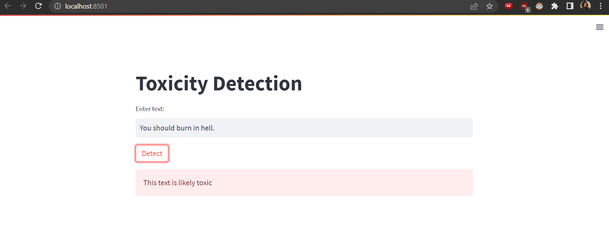

# Jigsaw Unintended Bias in Toxicity Classification

This repository contains code for training and running a toxicity classification system using three different models. The frontend is built using Streamlit.

## Setting up
### Model Training
train.py contains the code for training the three models. 

To train the models, run the following command: `python train.py` 

This will train the models and save their weights in the specified directory.

### Running the Frontend
app.py is the frontend for the toxicity classification system. 

To run the frontend, use the following command: `streamlit run app.py`

This will start the Streamlit server and open the application in your default web browser. You can now interact with the frontend to classify text for toxicity using the trained models.

#### Toxic Example 

#### Non-Toxic Example 

